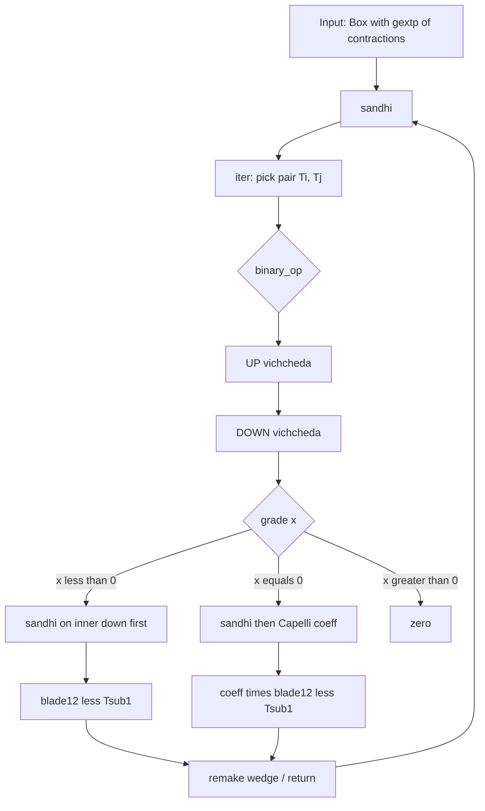

# Sandhi–Vichcheda: how the algorithm moves (diagrammatic)

How `gextpcanon.concat` turns a **wedge of contractions** into one **unified expression**: scalar coefficients out front, single merged contraction tree behind.

**Code:** `gextpcanon.py` (`sandhi`, `iter`, `binary_op`, `_split_common_unique`, `_scalar_part` → `CapelliOptionB`).  
**Tests:** `test_gextp.py`.  
**Notation:** `<` contraction, `^` wedge, `*` scalar, `|` inner product.

---

## End state we are aiming for

**Before** — many panels wired by `^`:

```text
  (up < down₁)  ^  (up < down₂)  ^  ...     ←  gextp of glcntrct terms
```

**After** — one unified form:

```text
  coeff₁ * coeff₂ * ...  *  ( UP < ONE_MERGED_DOWN_TREE )
       \___________/              \____________________/
        overlap scalars            single contraction
```

Coefficients come from **shared seams** (vichcheda) at each depth; the tree comes from **sandhi** (merge). The outer driver repeats until nothing else merges.

---

## Algorithm stack (top → bottom)

```text
  canon_iter(gextp)
       |
       v
  +---------------------------+
  | exhaust( ... )            |  repeat until fixed point
  |   do_one(                 |
  |     sandhi,               |  <-- concat.sandhi
  |     inv, proj, rej        |
  |   )                       |
  +---------------------------+
       |
       v
  concat.sandhi(expr, blade1=1)
       |
       v
  concat.iter(bx, blade1)     pick ONE pair of contractions; try merge
       |
       v
  concat.binary_op(T1, T2, blade1)   ONE merge attempt (vichcheda + sandhi + coeff)
       |
       +-- may call concat.sandhi again on inner down  (recursion)
```



---

## 1. Simple vichcheda (split)

Vichcheda = **find the shared seam** between two pieces, split into **common** + **unique**, track **±** from reordering.

### 1a. Down vichcheda (most common picture)

Two down-wedges share factor `S` (the seam):

```text
  LEFT   B1 ^ B2 ^ S              RIGHT   S ^ D1 ^ D2
              \___/                      \___/
               S                         S   = common_part

  unique left:  B1, B2          unique right:  D1, D2

  schematic:

    [B1][B2]  |  S  |  [D1][D2]
         \_____|_____|_____/
               seam
```

**Code:** `_split_common_unique(dn11, dn21)` → `dargs_U`, `sign1`, `sign2`, `common_part`.

```text
  sign1 = parity(dn11.args, reorder_to_unique_then_common)
  sign2 = parity(dn21.args, reorder_to_common_then_unique)

  dbx_U = gextp(B1, B2, S, D1, D2) * cf * sign1 * sign2
```

`sign1`, `sign2` are the **local ±** from vichcheda; they are **not** the overlap scalar yet—that comes from Capelli at `x == 0`.

### 1b. Up vichcheda (align upper blades)

Two contractions must share an **upper** contracting blade before down split matters.

```text
  SAME UP                    UP2 = UP1 ^ W
  -------                    --------------
  up1 == up2                 peel W into dn2:
  blade12 = up1                dn2' = (W < dn2) * parity(...)
  blade2 = blade1 ^ blade12  blade12 = UP1

  NO MATCH  -->  binary_op fails (no sandhi this pair)
```

**Accumulated blade** (grows each recursion level):

```text
  blade1  starts as 1  (scalar)
  blade2  = blade1 ^ blade12    ←  all shared ups seen on the path down
```

---

## 2. Simple sandhi (merge)

Sandhi = after vichcheda, **fuse** two compatible panels into **one** contraction.

**Canonical example:**

```text
  (A < (B1 ^ B2))  ^  (A < (B2 ^ B3))
```

```text
  BEFORE                          AFTER

      A                               A
      |                               |
   [B1][B2]      ^      [B2][B3]       |    [B1][B2][B3]
      panel 1            panel 2      v    one panel
```

Algebra: `A < (B1 ^ B2 ^ B3)` (times a scalar if overlap demands it—see §4).

**Code:** successful `binary_op` returns `(True, blade12 < Tsub1)` or `(True, coeff * (blade12 < Tsub1))`.

---

## 3. One `binary_op` cycle (how a single merge moves)

Diagram of **one** call on a pair `(expr1, expr2)` with current `blade1`:

```text
    expr1 = up1 < dn1          expr2 = up2 < dn2
              |                      |
              +----------+-----------+
                         |
                    [1] UP vichcheda
                         |  blade12, blade2 = blade1^blade12
                         v
                    [2] peel Box coeffs -> dn11, dn21, cf
                         |
                    [3] DOWN vichcheda
                         |  dargs_U, sign1, sign2, common_part
                         v
                    dbx_U = gextp(*dargs_U) * cf * sign1 * sign2
                         |
                    [4] grade gate
                         |
              x = grd(dn11)+grd(dn21) - grd(dbx_U) - grd(blade2)
                         |
         +---------------+---------------+
         |               |               |
       x < 0           x == 0          x > 0
    (nest inside)   (coeff level)     zero
```

The down split writes the two inputs as unique strips plus one shared seam.
Consequently, `dbx_U` contains each unique strip once and `common_part` once,
whereas `grd(dn11) + grd(dn21)` counts `common_part` twice. Scalar Box
coefficients and parity signs do not affect grade, so

```text
  grd(dn11) + grd(dn21) - grd(dbx_U) = grd(common_part)

  therefore:

  x = grd(common_part) - grd(blade2)
```

Thus the gate compares **seam size** with the accumulated contraction capacity:

| Gate | Meaning | Result |
|------|---------|--------|
| `x > 0` | seam exceeds the accumulated capacity | over-contraction → zero |
| `x == 0` | seam exactly saturates the capacity | merge and emit the overlap scalar |
| `x < 0` | capacity remains, so an inner merge is required | recurse; merge this pair only if recursion makes progress |

### Branch `x < 0` — recurse before coefficient

Common seam is still **inside** nested contractions in `dbx_U`. This level must **not** emit Capelli yet.

```text
    dbx_U  still "too deep"
         |
         v
    Tsub1 = sandhi(dbx_U, blade2)     ===== recursive call =====
         |
         +-- Tsub1 == dbx_U  -->  this pair did not merge; try another pair
         |
         v
    return  blade12 < Tsub1            (no Capelli coeff at THIS level)
```

```text
  schematic recursion into inner down:

    D1 < ( ... ( D3 < ( C1^C2^C3 ) ) ... )
         ^                    ^
         |                    +--- inner sandhi merges here first
         +--- outer waits
```

### Branch `x == 0` — sandhi + coefficient (unified step at this depth)

```text
    Tsub1 = sandhi(dbx_U, blade2)       inner cleanup on merged down
         |
         v
    coeff = CapelliOptionB.coefficient(blade2, common_part, sign1*sign2)
         |
         v
    return  coeff * ( blade12 < Tsub1 )   <-- unified at this level
```

```text
  diagram (x == 0):

         blade2 ~~~~~~~ common_part ~~~~~~~  (overlap geometry)
              \           |           /
               \    Capelli + sign1*sign2
                \         |         /
                 v       coeff      v
              coeff  *  ( blade12 < Tsub1 )
                 \_________|_________/
                      one term
```

### Branch `x > 0`

Incompatible merge → zero (`GExpr.Znl`).

---

## 4. How the coefficient is calculated

At **`x == 0` only**, overlap along the seam becomes an explicit scalar.

```text
  coeff = _scalar_part(blade2, common_part, sign1*sign2)
        = CapelliOptionB.coefficient(...) * (sign1 * sign2)
```

| Input | Meaning in diagram |
|-------|-------------------|
| `blade2` | accumulated up-path (`blade1 ^ blade12 ^ ...`) |
| `common_part` | seam blade from down vichcheda (e.g. `B2`, `a3`, `C1^C2^C3`) |
| `sign1*sign2` | ± from reordering strips during vichcheda |

**Example with visible scalar** (`test_gmul_2proj`):

```text
  (a1 < (a2 ^ a3)) ^ (a1 < (a3 ^ a4))
        |
        v  seam = a3, signs from parity
        v
  (a1 | a3)  *  ( a1 < (a2 ^ a3 ^ a4) )
     ^^^^^^^       ^^^^^^^^^^^^^^^^^^^^^
     coeff         unified contraction
```

Nested depths **multiply** coefficients when inner levels reach `x == 0`:

```text
  coeff_inner * coeff_mid * coeff_outer  *  ( outer < ...merged tree... )
```

(Test: `((D1^D2^D3)|(C1^C2^C3)) * (D1 < ...)` in `test_cases_sandhi_complex`.)

---

## 5. Outer loop: from many terms to one expression

`sandhi` on a wedge does **one** successful pairwise merge per call; `exhaust` repeats.

```text
  START   [T0] ^ [T1] ^ [T2] ^ [T3]
              \     /
               \   /   iter: try (T0,T1), (T0,T2), ... first success
                \ /
                 v
  STEP    [T01] ^ [T2] ^ [T3]        remake + parity on wedge slots
                 |
                 v  exhaust calls sandhi again ...
  END     coeff * ( UP < single down tree )   or  zero
```

```text
  movement over the whole expression:

    many glcntrct panels  --repeat sandhi-->  fewer panels  --...-->  ONE
                                                      \
                                                       +--> scalars collected
```

**`blade1`:** passed into nested `sandhi`; starts at `1`, unchanged at top `iter` (growth happens inside `binary_op` via `blade2 = blade1 ^ blade12`).

---

## 6. Full walkthrough: nested input → unified output

**Input (two deep panels sharing D1, D2, D3 and C-core):**

```text
  E1 = D1 < ( A1^A2 ^ ( D2 < ( B1^B2 ^ ( D3 < (C1^C2^C3) ) ) ) )
  E2 = D1 < ( A3^A4 ^ ( D2 < ( B3^B4 ^ ( D3 < (C1^C2^C3^C4) ) ) ) )
  INPUT = E1 ^ E2
```

**Phase A — outer `iter` picks (E1, E2), `binary_op`:**

```text
  [1] UP vichcheda     blade12 = D1,  blade2 = 1^D1
  [2] DOWN vichcheda   common cores inside nested downs; build dbx_U
  [3] x < 0            must recurse into dbx_U before outer coeff
  [4] sandhi(dbx_U)    inner merges on D3/C seam, then D2, ...
  [5] eventually x==0  coeff from Capelli on seam blades
  [6] return           coeff_total * ( D1 < merged_tree )
  [7] remake           INPUT becomes ONE term (plus other rules from exhaust)
```

**Unified output (test expectation):**

```text
  ((D1 ^ D2 ^ D3) | (C1 ^ C2 ^ C3))  *  ( D1 < ( A1^A2^A3^A4 ^ ( D2 < ( ... ) ) ) )
```

```text
  diagram of final shape:

    ((( D1-D2-D3 )))  x  [  ONE BIG CONTRACTION TREE  ]
         scalar              unified panel
```

---

## 7. Signs (±) in one place

Every factor is either **reorder sign** or **overlap scalar**:

```text
  vichcheda:   sign1, sign2  = parity(...)     on each strip
  up-peel:     sign            = parity(up.args, ...)
  coeff:       Capelli(...) * sign1 * sign2     at x == 0
  remake:      parity(wedge slot reorder)
```

**Nested rule:** at `x < 0`, `sign1*sign2` stay inside `dbx_U` until an **inner** `binary_op` hits `x == 0` and releases them into a `coeff`. They are not dropped.

Wedge flip convention: `(a1^a2).coeff == -(a2^a1).coeff` (`test_0`).

---

## 8. Code ↔ diagram index

| Diagram step | Function |
|--------------|----------|
| Pick pair in wedge | `concat.iter` |
| UP split / align | `binary_op` step 1 |
| DOWN split | `_split_common_unique` |
| ± on reorder | `parity` in `util.py` |
| Grade decision | `x = grd12 - grd(dbx_U) - grd(blade2)` |
| Inner merge | `concat.sandhi(dbx_U, blade2)` |
| Overlap scalar | `_scalar_part` → `CapelliOptionB.coefficient` |
| Replace pair in wedge | `concat.remake` |
| Until done | `exhaust(do_one(sandhi, ...))` |

---

## 9. Verification

```python
from Sygal.strategies.iters import canon_iter
from Sygal.operators.assop.gextp import gextp

assert canon_iter(gextp)(input_expr) == expected_expr
```

Ground truth = `test_gextp.py`. For algebra status (complete on fragment vs open gaps), see `status.md`.

---

## Related

- `tutorial.md` — worked sign arithmetic
- `extsimp.md` — Hopf (Δ ↔ split, collect ↔ merge)
- `status.md` — implementation completeness (algebra only)
